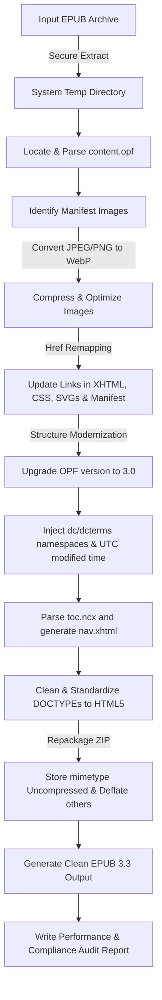

# 🚀 ePubLift — EPUB Upgrader & Optimizer

[](https://www.gnu.org/licenses/agpl-3.0)
[](https://www.rust-lang.org/)
[](https://github.com/ePubLift/epublift/releases)
[](http://makeapullrequest.com)

A fast, standard-compliant tool written in **Rust** to modernize, optimize, and significantly shrink EPUB files. Today it upgrades legacy **EPUB 2.0** structures to the **EPUB 3.3** specification and re-encodes heavy raster images (JPEG/PNG) into compact **WebP** — with support for newer EPUB versions and next-generation image formats (AVIF / JPEG XL) planned on the [roadmap](ROADMAP.md).

Use it as a **command-line tool**, as a **library**, or as a self-hostable **web service** — try the hosted instance at **<https://epublift.itpax.net>** or [run your own with Docker](#-hosted-web-service-epublift-web).

ePubLift began as a Rust port of an earlier Python implementation but has since grown into an independent, more capable tool — a fully pure-Rust build with no C dependencies and features beyond the original. Released under the AGPL-3.0 license.

---

## ✨ Key Features

*   **🔒 Workspace Safety**: Extracts and processes files inside a system-managed secure temporary directory. The original file remains completely untouched unless the entire operations pipeline completes successfully.
*   **📸 WebP Image Optimization**:
    *   Automatically converts heavy JPEG and PNG images to WebP format.
    *   Preserves PNG alpha channel transparency.
    *   Allows customizable quality level settings (1–100).
    *   Automatically scans and updates all image references in CSS, XHTML/HTML files, SVG graphics, and the OPF manifest.
*   **🛡️ Size-Safe by Design** — re-encoding never makes a book bigger:
    *   **Keeps the smaller file.** If the WebP isn't actually smaller than the source, the original image is kept untouched, so the output can never grow.
    *   **Never upscales quality.** For a JPEG source the WebP quality is capped at the source's own (estimated) quality — a low-quality chart isn't re-encoded at a higher quality, which would only add bytes, not detail.
    *   **Keeps grayscale grayscale.** Grayscale images are encoded as single-channel WebP instead of being expanded to RGB.
*   **⚡ EPUB 3.3 Compliance Upgrade**:
    *   Upgrades package declarations in the OPF metadata to version `3.0`.
    *   Injects required `dcterms:modified` UTC metadata timestamps.
    *   Parses legacy `toc.ncx` maps and generates a standard **EPUB 3 Navigation Document (`nav.xhtml`)** with clean nested elements.
    *   Converts outdated `<guide>` landmark reference lists into HTML5 `<nav epub:type="landmarks">` maps.
    *   Standardizes legacy XHTML DOCTYPEs (like XHTML 1.1) to modern HTML5 `<!DOCTYPE html>` structure.
*   **📊 Detailed Audit Reports**: Generates a detailed size comparison table and conversion metrics report in an easy-to-read text file.
*   **🌐 Browser & Docker Ready**: A hardened [web service](#-hosted-web-service-epublift-web) converts EPUBs in the browser — uploads are processed in memory and deleted immediately. Ships as a multi-arch Docker image for one-command self-hosting.

---

## 🛠️ Technical Design & Pipeline



### 📱 E-Reader Compatibility
To ensure broad compatibility, ePubLift retains legacy `toc.ncx` maps and OPF pointers alongside the newly-generated EPUB 3.3 `nav.xhtml` navigation document. This creates a fully **backward-compatible** hybrid document that runs smoothly on vintage EPUB 2 devices while delivering high-speed modern features and layout compliance on new EPUB 3.3 devices.

---

## 📥 Installation

### Download a pre-built binary (recommended)

Grab the archive for your platform from the [**latest release**](https://github.com/ePubLift/epublift/releases/latest):

| Platform | Archive |
| :--- | :--- |
| Linux (x86_64, static musl) | `epublift-<version>-x86_64-unknown-linux-musl.tar.gz` |
| Windows (x86_64) | `epublift-<version>-x86_64-pc-windows-msvc.zip` |
| macOS (Apple Silicon) | `epublift-<version>-aarch64-apple-darwin.tar.gz` |
| macOS (Intel) | `epublift-<version>-x86_64-apple-darwin.tar.gz` |

Each archive bundles the `epublift` binary plus the README, license, and changelog, and ships with a `.sha256` checksum file. Unpack it and put `epublift` somewhere on your `PATH`:

```bash
tar -xzf epublift-*-aarch64-apple-darwin.tar.gz
sudo install epublift-*/epublift /usr/local/bin/
```

> The Linux build is statically linked against musl, so it runs on any x86_64 distribution with no glibc or system-library requirements.

#### First run on macOS and Windows

The pre-built macOS and Windows binaries are **not yet code-signed**, so the OS shows a one-time warning the first time you run a freshly downloaded copy. This is expected; the Linux binary is unaffected.

- **macOS** — Gatekeeper reports the developer "cannot be verified." Clear the download quarantine flag once:
  ```bash
  xattr -d com.apple.quarantine ./epublift
  ```
  (or open **System Settings → Privacy & Security** and click *Allow Anyway*).
- **Windows** — Microsoft Defender SmartScreen shows *"Windows protected your PC."* Click **More info → Run anyway**.

Each release archive ships with a `.sha256` file so you can verify the download integrity before running it.

### Build from source

This utility is **pure Rust** — it only requires the **Rust toolchain** (1.94+). No C compiler or system libraries needed; WebP encoding is handled by the pure-Rust [`zenwebp`](https://crates.io/crates/zenwebp) crate.

```bash
# Clone the repository
git clone https://github.com/ePubLift/epublift.git
cd epublift

# Build an optimized release binary
cargo build --release

# The binary is produced at:
#   target/release/epublift
```

You can optionally install it onto your `PATH`:

```bash
cargo install --path .
```

---

## 🚀 How to Use

### Basic Command

```bash
epublift -i <path_to_input_epub>
```
*This command modernizes the input file and saves it in the same directory as `<input_name>_v3.3.epub`, generating a performance report in `<input_name>_report.txt`.*

During development you can also run it directly with Cargo:

```bash
cargo run --release -- -i book.epub
```

### Advanced Options

```bash
epublift -i book.epub -o optimized_book.epub -q 85 -r stats_report.txt
```

### Command Line Interface Options

| Argument | Long Flag | Description | Default |
| :--- | :--- | :--- | :--- |
| `-i` | `--input` | **[Required]** Path to the original EPUB file | *None* |
| `-o` | `--output` | Path to save the modernized EPUB | `<input>_v3.3.epub` |
| `-q` | `--quality`| WebP compression quality level (1-100) | `80` |
| `-r` | `--report` | Path to write the conversion audit report | `<input>_report.txt` |
| | `--ascii` | Transliterate the auto-generated output/report names to ASCII | *off* |
| | `--keep-images` | Keep original images (skip JPEG/PNG → WebP) for readers that don't render WebP | *off* |
| | `--kepub` | Produce a Kobo `.kepub.epub` (inject `koboSpan` markup; implies `--keep-images`) | *off* |

#### Keep original images (`--keep-images`)

By default epublift converts JPEG/PNG to **WebP**, which most readers (Apple Books, Calibre, and other apps) render fine and which gives the biggest size win. But some devices advertise EPUB 3.3 support yet **do not actually render WebP** — notably **Kobo e-ink readers** (Forma, Sage, …), where a WebP-converted book shows blank images. For those, use `--keep-images` to leave images in their original format while still modernizing the structure:

```bash
epublift -i book.epub --keep-images
```

`--kepub` turns this on automatically, since its target is Kobo.

#### Kobo `.kepub` output (`--kepub`)

[Kobo](https://www.kobo.com/) e-readers unlock their richer reading features — accurate page turns, reading statistics, and dictionary lookup — when a book carries Kobo's `koboSpan` markup. Add `--kepub` to produce a Kobo-optimized file alongside the normal EPUB 3 upgrades:

```bash
epublift -i book.epub --kepub
# → book.kepub.epub
```

The result is still a valid EPUB 3 (Kobo simply keys on the `.kepub.epub` extension and the spans), so the same file also opens in other readers. The transform follows the approach of the open-source [`kepubify`](https://github.com/pgaskin/kepubify): sentence-level spans, each image in its own paragraph, and Kobo's column scaffolding. Sideload the `.kepub.epub` onto your Kobo (into the `.kobo` folder or via Calibre) to use it.

#### ASCII-safe filenames (`--ascii`)

By default epublift **preserves your original filename**, only appending the `_v3.3` suffix — so `Işık Doğudan Yükselir.epub` becomes `Işık Doğudan Yükselir_v3.3.epub`. Modern e-readers and filesystems handle these Unicode names without issue, and the title/author shown on your device come from the EPUB's own metadata, not the filename.

If you prefer a shell-friendly, ASCII-only name (handy for the command line, FAT32 SD cards, or older sync tools), add `--ascii`:

```bash
epublift -i "Işık Doğudan Yükselir.epub" --ascii
# → Isik_Dogudan_Yukselir_v3.3.epub
```

This romanizes Unicode letters (e.g. Turkish `ş→s`, `ğ→g`, `ı→i`, `ö→o`, `ü→u`), turns whitespace into underscores, and drops other punctuation. Transliteration is lossy and not always locale-perfect, which is why it is **off by default**. The flag only affects auto-generated names — an explicit `-o`/`-r` path is always used verbatim.

---

## 🌐 Hosted Web Service (`epublift-web`)

Beyond the CLI, ePubLift ships a small **web service**: drag-and-drop an EPUB in your browser and get back the modernized file plus an in-page audit report. It's powered by the same pure-Rust `convert()` core, and uploads are processed **in memory and deleted immediately** — nothing is ever stored or logged.

> 💡 A hosted instance runs at **<https://epublift.itpax.net>**. Or self-host it in one command (below).

### Run with Docker

A hardened, multi-arch (amd64 + arm64) image is published to the GitHub Container Registry on every release:

```bash
docker run -d --name epublift-web \
  -p 127.0.0.1:8080:8080 \
  ghcr.io/epublift/epublift-web:latest
```

Then open <http://127.0.0.1:8080>. Pin a specific version with a tag instead of `latest`, e.g. `ghcr.io/epublift/epublift-web:1.2.1`. The image is a static musl binary on Alpine, runs as a non-root user, and is only ~14 MB.

### Run with Docker Compose (recommended)

The repo's [`docker-compose.yml`](docker-compose.yml) adds the full hardening profile — read-only root filesystem, all Linux capabilities dropped, `no-new-privileges`, memory/PID limits, and a `tmpfs` for the only writable path:

```bash
docker compose up -d
```

### Put it behind a reverse proxy (TLS)

The service speaks plain HTTP on port `8080` and binds to localhost, so terminate TLS with a reverse proxy (Nginx Proxy Manager, Caddy, Traefik, …) in front of it. One required setting: raise the proxy's max request-body size to match the service's **50 MiB** upload limit — otherwise large uploads are rejected at the proxy with `413`. For Nginx (and Nginx Proxy Manager's *Advanced* tab):

```nginx
client_max_body_size 50M;
```

If your proxy **also runs as a container**, it can't reach the host's `127.0.0.1:8080`. Put both on a shared Docker network and point the proxy at the service by name — `http://epublift-web:8080` (the container's internal port `8080`, regardless of how the host port is published).

### Security & privacy

The endpoint is public and the source is open, so these limits are the real defense — not obscurity:

*   **No retention** — each request is converted in a temp dir wiped on success *or* error; no upload is stored or logged.
*   **Strict Content-Security-Policy** (`default-src 'none'`) plus `X-Frame-Options`, `X-Content-Type-Options`, and locked-down CORS on every response.
*   **Abuse limits** — a 50 MiB body cap, a request timeout, per-IP rate limiting, and a concurrency cap that keeps latency predictable.
*   **Input hardening** (shared with the CLI) — zip-bomb (uncompressed-size + entry-count caps) and image decode-bomb (dimension/allocation limits) guards.
*   **Optional egress-blocking** — the converter never makes outbound connections, so `docker-compose.yml` documents how to run it on an `internal` Docker network with no route to the internet at all.

> **AGPL-3.0 note:** if you run a **modified** copy of this service over a network, §13 requires you to offer your modified source to its users. The page carries a visible **Source** link to satisfy this.

---

## 🧪 Quick Sandbox Testing

A companion binary (`gen-sample`) builds a valid legacy EPUB 2.0 file containing test images and outdated structures, so you can safely evaluate the tool.

### Step 1: Generate the Sample EPUB 2.0 File
```bash
cargo run --release --bin gen-sample
```
*This creates a new legacy file named `sample_epub2.epub` in your current folder.*

### Step 2: Run epublift
```bash
cargo run --release --bin epublift -- -i sample_epub2.epub
```
*This converts the book, modernizes the structure to EPUB 3.3, and produces `sample_epub2_v3.3.epub` along with `sample_epub2_report.txt`.*

### Step 3: Inspect the Output Audit Report
```bash
cat sample_epub2_report.txt
```

---

## 📄 License & Sharing

This project is licensed under the **GNU Affero General Public License, Version 3 (AGPL-3.0)**.

### Why AGPL-3.0?
We believe in open source. By sharing this software under the AGPL license, we ensure that:
1. Anyone is free to use, modify, and distribute this tool.
2. If you modify this tool and run it as part of an online service (e.g. an e-book conversion website), you **must** make your modified source code available to users of that service.

For full terms and conditions, please consult the [LICENSE](LICENSE) file in the root of this repository.
