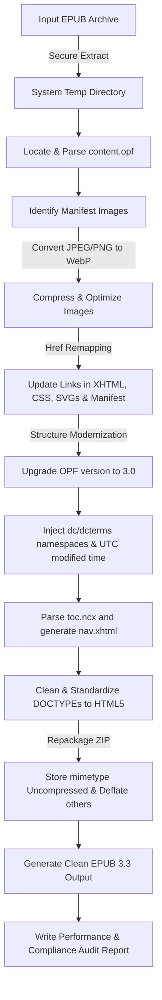

# 🚀 ePubLift — EPUB Upgrader & Optimizer

[](https://www.gnu.org/licenses/agpl-3.0)
[](https://www.rust-lang.org/)
[](https://github.com/ePubLift/epublift/releases)
[](http://makeapullrequest.com)

A fast, standard-compliant tool written in **Rust** to modernize, optimize, and significantly shrink EPUB files. Today it upgrades legacy **EPUB 2.0** structures to the **EPUB 3.3** specification and re-encodes heavy raster images (JPEG/PNG) into compact **WebP** — with support for newer EPUB versions and next-generation image formats (AVIF / JPEG XL) planned on the [roadmap](ROADMAP.md). It can also produce **Kobo `.kepub`** files for richer reading features on Kobo devices, and a **`--keep-images`** mode for readers that don't render WebP.

Use it as a **command-line tool**, as a **library**, or as a self-hostable **web service** — try the hosted instance at **<https://epublift.itpax.net>** or [run your own with Docker](#-hosted-web-service-epublift-web).

ePubLift began as a Rust port of an earlier Python implementation but has since grown into an independent, more capable tool — a fully pure-Rust build with no C dependencies and features beyond the original. Released under the AGPL-3.0 license.

---

## ✨ Key Features

*   **🔒 Workspace Safety**: Extracts and processes files inside a system-managed secure temporary directory. The original file remains completely untouched unless the entire operations pipeline completes successfully.
*   **📸 WebP Image Optimization**:
    *   Automatically converts heavy JPEG and PNG images to WebP format.
    *   Preserves PNG alpha channel transparency.
    *   Allows customizable quality level settings (1–100).
    *   Automatically scans and updates all image references in CSS, XHTML/HTML files, SVG graphics, and the OPF manifest.
    *   **`--keep-images` escape hatch:** skip WebP and keep the original JPEG/PNG for readers that don't render WebP (notably **Kobo e-ink**, which shows blank images otherwise) — the structure is still modernized.
*   **📖 Kobo `.kepub` output (`--kepub`)**: Injects Kobo's `koboSpan` markup (à la [`kepubify`](https://github.com/pgaskin/kepubify)) to unlock faster page turns, reading statistics, and dictionary lookup on Kobo devices, naming the file `<name>.kepub.epub`. Still a valid EPUB 3, and keeps original images automatically (Kobo can't render WebP).
*   **🛡️ Size-Safe by Design** — re-encoding never makes a book bigger:
    *   **Keeps the smaller file.** If the WebP isn't actually smaller than the source, the original image is kept untouched, so the output can never grow.
    *   **Never upscales quality.** For a JPEG source the WebP quality is capped at the source's own (estimated) quality — a low-quality chart isn't re-encoded at a higher quality, which would only add bytes, not detail.
    *   **Keeps grayscale grayscale.** Grayscale images are encoded as single-channel WebP instead of being expanded to RGB.
*   **⚡ EPUB 3.3 Compliance Upgrade**:
    *   Upgrades package declarations in the OPF metadata to version `3.0`.
    *   Injects required `dcterms:modified` UTC metadata timestamps.
    *   Parses legacy `toc.ncx` maps and generates a standard **EPUB 3 Navigation Document (`nav.xhtml`)** with clean nested elements.
    *   Converts outdated `<guide>` landmark reference lists into HTML5 `<nav epub:type="landmarks">` maps.
    *   Standardizes legacy XHTML DOCTYPEs (like XHTML 1.1) to modern HTML5 `<!DOCTYPE html>` structure.
*   **📦 Archive your library (`.eparc`)**: `epublift archive` shrinks EPUB(s) into compact, **lossless** `.eparc` archives to save disk space; `epublift restore` brings any book back — content-exact by default, or re-targeted for a specific reader (`--target 3.3`, `--keep-images`, `--kepub`). Pure-Rust solid Zstandard on text + fonts, media stored verbatim, so it never grows a book. See [Archive your library](#-archive-your-library-eparc).
*   **📊 Detailed Audit Reports**: Generates a detailed size comparison table and conversion metrics report in an easy-to-read text file.
*   **🌐 Browser & Docker Ready**: A hardened [web service](#-hosted-web-service-epublift-web) does it all in the browser — **optimize** an EPUB, **archive** a book to a compact `.eparc`, or **restore** one back — with uploads processed in memory and deleted immediately. Ships as a multi-arch Docker image for one-command self-hosting.

---

## 🛠️ Technical Design & Pipeline



### 📱 E-Reader Compatibility
To ensure broad compatibility, ePubLift retains legacy `toc.ncx` maps and OPF pointers alongside the newly-generated EPUB 3.3 `nav.xhtml` navigation document. This creates a fully **backward-compatible** hybrid document that runs smoothly on vintage EPUB 2 devices while delivering high-speed modern features and layout compliance on new EPUB 3.3 devices.

---

## 📥 Installation

### Download a pre-built binary (recommended)

Grab the archive for your platform from the [**latest release**](https://github.com/ePubLift/epublift/releases/latest):

| Platform | Archive |
| :--- | :--- |
| Linux (x86_64, static musl) | `epublift-<version>-x86_64-unknown-linux-musl.tar.gz` |
| Linux (ARM64 / **Raspberry Pi**, static musl) | `epublift-<version>-aarch64-unknown-linux-musl.tar.gz` |
| Windows (x86_64) | `epublift-<version>-x86_64-pc-windows-msvc.zip` |
| macOS (Apple Silicon) | `epublift-<version>-aarch64-apple-darwin.tar.gz` |
| macOS (Intel) | `epublift-<version>-x86_64-apple-darwin.tar.gz` |

Each archive bundles the `epublift` binary plus the README, license, and changelog, and ships with a `.sha256` checksum file. Unpack it and put `epublift` somewhere on your `PATH`:

```bash
tar -xzf epublift-*-aarch64-apple-darwin.tar.gz
sudo install epublift-*/epublift /usr/local/bin/
```

> The Linux builds are statically linked against musl, so they run on any x86_64 or ARM64 distribution (including 64-bit Raspberry Pi OS) with no glibc or system-library requirements.

#### Linux packages (`.deb` / `.rpm`)

Prefer your package manager? Each release also ships native packages for **amd64/arm64** (so they install cleanly on a Raspberry Pi too):

```bash
# Debian / Ubuntu / Raspberry Pi OS
sudo apt install ./epublift_<version>-1_arm64.deb     # or _amd64

# Fedora / RHEL / openSUSE
sudo dnf install ./epublift-<version>-1.aarch64.rpm   # or .x86_64
```

#### First run on macOS and Windows

The pre-built macOS and Windows binaries are **not yet code-signed**, so the OS shows a one-time warning the first time you run a freshly downloaded copy. This is expected; the Linux binary is unaffected.

- **macOS** — Gatekeeper reports the developer "cannot be verified." Clear the download quarantine flag once:
  ```bash
  xattr -d com.apple.quarantine ./epublift
  ```
  (or open **System Settings → Privacy & Security** and click *Allow Anyway*).
- **Windows** — Microsoft Defender SmartScreen shows *"Windows protected your PC."* Click **More info → Run anyway**.

Each release archive ships with a `.sha256` file so you can verify the download integrity before running it.

### Build from source

This utility is **pure Rust** — it only requires the **Rust toolchain** (1.94+). No C compiler or system libraries needed; WebP encoding is handled by the pure-Rust [`zenwebp`](https://crates.io/crates/zenwebp) crate.

```bash
# Clone the repository
git clone https://github.com/ePubLift/epublift.git
cd epublift

# Build an optimized release binary
cargo build --release

# The binary is produced at:
#   target/release/epublift
```

You can optionally install it onto your `PATH`:

```bash
cargo install --path .
```

---

## 🚀 Usage

```bash
epublift -i book.epub            # modernize + shrink images → book_v3.3.epub
```

| Your situation | Command |
| :--- | :--- |
| Smaller, modernized EPUB (most people) | `epublift -i book.epub` |
| Reading on a Kobo | `epublift -i book.epub --kepub` |
| Images blank after converting | `epublift -i book.epub --keep-images` |
| ASCII-only output filename | `epublift -i book.epub --ascii` |
| Shrink a whole library to `.eparc` | `epublift archive ~/Books` |
| Restore an archived book | `epublift restore book.eparc` |

Every flag, per-situation recipes, and sandbox testing are in the **[Usage guide](docs/usage.md)**. epublift is also a Rust **library** — build `Options`, call `convert()`, inspect the `Report`.

---

## 📦 Archive your library (`.eparc`)

Shrink a personal EPUB collection to save disk, and get any book back on demand — **losslessly**. `epublift archive` packs each book into a compact `.eparc` (pure-Rust solid [Zstandard](https://facebook.github.io/zstd/) on text + fonts, already-compressed media stored verbatim, so it **never grows a book**); `epublift restore` brings it back content-exact, or re-targeted for your reader.

```bash
epublift archive ~/Books         # one .eparc per book; recurses the folder
epublift restore book.eparc      # → content-exact .epub (or --target 3.3 / --keep-images / --kepub)
```

Lossless, runs anywhere from a Raspberry Pi to a NAS. Full guide: **[Archiving guide](docs/archiving.md)** · design notes: [format](docs/design/eparc-format.md), [codec choice](docs/design/eparc-codec-choice.md).

---

## 🌐 Hosted Web Service (`epublift-web`)

Drag-and-drop an EPUB in your browser and pick a mode: **Optimize** (modernize to EPUB 3.3 + WebP, with an in-page audit report), **Archive** a book to a compact `.eparc`, or **Restore** an `.eparc` back to a working `.epub` — content-exact by default, or modernized on the way out. The same pure-Rust core, with uploads processed **in memory and deleted immediately** (nothing stored or logged). Available in **13 languages**.

> 💡 Hosted instance: **<https://epublift.itpax.net>**. Or self-host in one command:

```bash
docker run -d -p 127.0.0.1:8080:8080 ghcr.io/epublift/epublift-web:latest
```

The full hardening profile, reverse-proxy/TLS setup, and the privacy/security model are in the **[Web service guide](docs/web-service.md)**.

---

## 📚 Documentation

- **[Usage guide](docs/usage.md)** — every flag, per-situation recipes, sandbox testing.
- **[Archiving guide](docs/archiving.md)** — `archive` / `restore` and the `.eparc` format.
- **[Web service guide](docs/web-service.md)** — self-hosting `epublift-web`.
- **[Experimental Zstandard packaging](docs/zstandard-research.md)** — research track (non-conformant, measurement only).
- Design notes: [`.eparc` format](docs/design/eparc-format.md) · [`.eparc` codec choice](docs/design/eparc-codec-choice.md) · [Zstd-OCF experiment](docs/design/zstd-ocf-experimental.md).
- [Roadmap](ROADMAP.md) · [Changelog](CHANGELOG.md).

---

## 🏷️ Versioning & releases

ePubLift is one repository with two independently-released products that share a
common Rust core:

| Product | Released via tag | Where to get it |
| :--- | :--- | :--- |
| **CLI** (`epublift` binaries) | `cli-vX.Y.Z` | [GitHub Releases](https://github.com/ePubLift/epublift/releases) |
| **Web service** (`epublift-web` Docker image) | `web-vX.Y.Z` | `ghcr.io/epublift/epublift-web:X.Y.Z` (+ `:latest`) |

They version on their own lines, so the web service can ship fixes (e.g. a
dependency security update) without forcing a new CLI build, and vice versa.
Their numbers may differ — that's expected; pick the line for the product you
use. A change to the shared core is released on **both** lines together.

---

## 📄 License & Sharing

This project is licensed under the **GNU Affero General Public License, Version 3 (AGPL-3.0)**.

### Why AGPL-3.0?
We believe in open source. By sharing this software under the AGPL license, we ensure that:
1. Anyone is free to use, modify, and distribute this tool.
2. If you modify this tool and run it as part of an online service (e.g. an e-book conversion website), you **must** make your modified source code available to users of that service.

For full terms and conditions, please consult the [LICENSE](LICENSE) file in the root of this repository.
