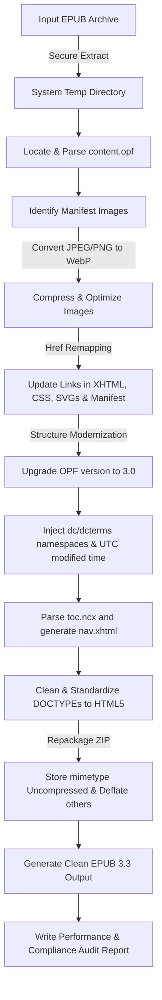

# 🚀 ePubLift — EPUB Upgrader & Optimizer

[](https://www.gnu.org/licenses/agpl-3.0)
[](https://www.rust-lang.org/)
[](https://github.com/ePubLift/epublift/releases)
[](http://makeapullrequest.com)

A fast, standard-compliant command-line utility written in **Rust** to modernize, optimize, and significantly shrink EPUB files. Today it upgrades legacy **EPUB 2.0** structures to the **EPUB 3.3** specification and re-encodes heavy raster images (JPEG/PNG) into compact **WebP** — with support for newer EPUB versions and next-generation image formats (AVIF / JPEG XL) planned on the [roadmap](ROADMAP.md).

ePubLift began as a Rust port of an earlier Python implementation but has since grown into an independent, more capable tool — a fully pure-Rust build with no C dependencies and features beyond the original. Released under the AGPL-3.0 license.

---

## ✨ Key Features

*   **🔒 Workspace Safety**: Extracts and processes files inside a system-managed secure temporary directory. The original file remains completely untouched unless the entire operations pipeline completes successfully.
*   **📸 WebP Image Optimization**:
    *   Automatically converts heavy JPEG and PNG images to WebP format.
    *   Preserves PNG alpha channel transparency.
    *   Allows customizable quality level settings (1–100).
    *   Automatically scans and updates all image references in CSS, XHTML/HTML files, SVG graphics, and the OPF manifest.
*   **⚡ EPUB 3.3 Compliance Upgrade**:
    *   Upgrades package declarations in the OPF metadata to version `3.0`.
    *   Injects required `dcterms:modified` UTC metadata timestamps.
    *   Parses legacy `toc.ncx` maps and generates a standard **EPUB 3 Navigation Document (`nav.xhtml`)** with clean nested elements.
    *   Converts outdated `<guide>` landmark reference lists into HTML5 `<nav epub:type="landmarks">` maps.
    *   Standardizes legacy XHTML DOCTYPEs (like XHTML 1.1) to modern HTML5 `<!DOCTYPE html>` structure.
*   **📊 Detailed Audit Reports**: Generates a detailed size comparison table and conversion metrics report in an easy-to-read text file.

---

## 🛠️ Technical Design & Pipeline



### 📱 E-Reader Compatibility
To ensure broad compatibility, ePubLift retains legacy `toc.ncx` maps and OPF pointers alongside the newly-generated EPUB 3.3 `nav.xhtml` navigation document. This creates a fully **backward-compatible** hybrid document that runs smoothly on vintage EPUB 2 devices while delivering high-speed modern features and layout compliance on new EPUB 3.3 devices.

---

## 📥 Installation

### Download a pre-built binary (recommended)

Grab the archive for your platform from the [**latest release**](https://github.com/ePubLift/epublift/releases/latest):

| Platform | Archive |
| :--- | :--- |
| Linux (x86_64, static musl) | `epublift-<version>-x86_64-unknown-linux-musl.tar.gz` |
| Windows (x86_64) | `epublift-<version>-x86_64-pc-windows-msvc.zip` |
| macOS (Apple Silicon) | `epublift-<version>-aarch64-apple-darwin.tar.gz` |
| macOS (Intel) | `epublift-<version>-x86_64-apple-darwin.tar.gz` |

Each archive bundles the `epublift` binary plus the README, license, and changelog, and ships with a `.sha256` checksum file. Unpack it and put `epublift` somewhere on your `PATH`:

```bash
tar -xzf epublift-*-aarch64-apple-darwin.tar.gz
sudo install epublift-*/epublift /usr/local/bin/
```

> The Linux build is statically linked against musl, so it runs on any x86_64 distribution with no glibc or system-library requirements.

### Build from source

This utility is **pure Rust** — it only requires the **Rust toolchain** (1.94+). No C compiler or system libraries needed; WebP encoding is handled by the pure-Rust [`zenwebp`](https://crates.io/crates/zenwebp) crate.

```bash
# Clone the repository
git clone https://github.com/ePubLift/epublift.git
cd epublift

# Build an optimized release binary
cargo build --release

# The binary is produced at:
#   target/release/epublift
```

You can optionally install it onto your `PATH`:

```bash
cargo install --path .
```

---

## 🚀 How to Use

### Basic Command

```bash
epublift -i <path_to_input_epub>
```
*This command modernizes the input file and saves it in the same directory as `<input_name>_v3.3.epub`, generating a performance report in `<input_name>_report.txt`.*

During development you can also run it directly with Cargo:

```bash
cargo run --release -- -i book.epub
```

### Advanced Options

```bash
epublift -i book.epub -o optimized_book.epub -q 85 -r stats_report.txt
```

### Command Line Interface Options

| Argument | Long Flag | Description | Default |
| :--- | :--- | :--- | :--- |
| `-i` | `--input` | **[Required]** Path to the original EPUB file | *None* |
| `-o` | `--output` | Path to save the modernized EPUB | `<input>_v3.3.epub` |
| `-q` | `--quality`| WebP compression quality level (1-100) | `80` |
| `-r` | `--report` | Path to write the conversion audit report | `<input>_report.txt` |
| | `--ascii` | Transliterate the auto-generated output/report names to ASCII | *off* |

#### ASCII-safe filenames (`--ascii`)

By default epublift **preserves your original filename**, only appending the `_v3.3` suffix — so `Işık Doğudan Yükselir.epub` becomes `Işık Doğudan Yükselir_v3.3.epub`. Modern e-readers and filesystems handle these Unicode names without issue, and the title/author shown on your device come from the EPUB's own metadata, not the filename.

If you prefer a shell-friendly, ASCII-only name (handy for the command line, FAT32 SD cards, or older sync tools), add `--ascii`:

```bash
epublift -i "Işık Doğudan Yükselir.epub" --ascii
# → Isik_Dogudan_Yukselir_v3.3.epub
```

This romanizes Unicode letters (e.g. Turkish `ş→s`, `ğ→g`, `ı→i`, `ö→o`, `ü→u`), turns whitespace into underscores, and drops other punctuation. Transliteration is lossy and not always locale-perfect, which is why it is **off by default**. The flag only affects auto-generated names — an explicit `-o`/`-r` path is always used verbatim.

---

## 🧪 Quick Sandbox Testing

A companion binary (`gen-sample`) builds a valid legacy EPUB 2.0 file containing test images and outdated structures, so you can safely evaluate the tool.

### Step 1: Generate the Sample EPUB 2.0 File
```bash
cargo run --release --bin gen-sample
```
*This creates a new legacy file named `sample_epub2.epub` in your current folder.*

### Step 2: Run epublift
```bash
cargo run --release --bin epublift -- -i sample_epub2.epub
```
*This converts the book, modernizes the structure to EPUB 3.3, and produces `sample_epub2_v3.3.epub` along with `sample_epub2_report.txt`.*

### Step 3: Inspect the Output Audit Report
```bash
cat sample_epub2_report.txt
```

---

## 📄 License & Sharing

This project is licensed under the **GNU Affero General Public License, Version 3 (AGPL-3.0)**.

### Why AGPL-3.0?
We believe in open source. By sharing this software under the AGPL license, we ensure that:
1. Anyone is free to use, modify, and distribute this tool.
2. If you modify this tool and run it as part of an online service (e.g. an e-book conversion website), you **must** make your modified source code available to users of that service.

For full terms and conditions, please consult the [LICENSE](LICENSE) file in the root of this repository.
